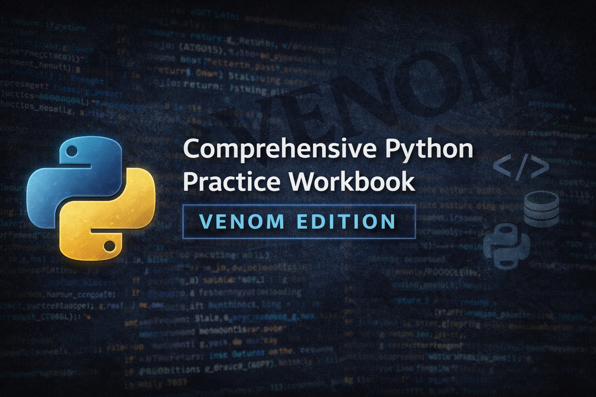

<!-- Banner -->
<p align="center">
  
</p>

# 🐍 Comprehensive Python Practice Workbook – Venom Edition

<p align="center">
  
  
  
  
  
</p>

A professionally curated Python workbook focused on **practical problem-solving**,  
covering fundamentals to advanced, real-world and interview-grade challenges.

This workbook emphasizes **thinking in Python**, not memorizing syntax.

---

## 📄 Download the Workbook (PDF)

👉 **[Comprehensive Python Practice Workbook – Venom Edition](Comprehensive_Python_Practice_Workbook_Venom.pdf)**  
📦 **[Also available via GitHub Releases](https://github.com/Venom-Shivu/Comprehensive-Python-Practice-Workbook-Venom/releases)**

> The PDF is the **authoritative and complete version**.  
> Markdown files provide readable previews and sample questions.

---

## 📘 About the Workbook

**Python Practice Workbook – Venom Edition** contains **50+ professionally designed problems** covering:

- Python fundamentals  
- Object-Oriented Programming  
- Advanced Python concepts  
- Professional and interview-grade challenges  

Each problem includes a **difficulty level**, **real-world context tags**,  
and **solution guidelines** focused on clarity and reasoning.

---

## 🧭 Structure Overview

- **Section 1:** Python Basics  
- **Section 2:** Object-Oriented Programming  
- **Section 3:** Advanced Python  
- **Section 4:** Professional Python Challenges  
- **Appendix:** Learning paths and best practices  

---

## 📂 Repository Contents

```

.
├── README.md
├── Comprehensive_Python_Practice_Workbook_Venom.pdf
├── sections/
│   ├── section-1-python-basics.md
│   ├── section-2-object-oriented-programming.md
│   ├── section-3-advanced-python.md
│   └── section-4-professional-python-challenges.md
├── assets/
│   └── venom-python-banner.png
└── LICENSE.md

```

---

## 🎯 Intended Audience

- Python learners building strong fundamentals  
- Interview candidates  
- Backend-focused developers  
- Self-taught programmers seeking professional practice  

---

## ⚖️ License & Usage

© 2026 **Shivansh Yadav**. All rights reserved.

This repository is intended for **personal learning, academic use, and non-commercial skill development**.  
Redistribution or commercial use requires prior written permission.

---

## ⚖️ Fair Use Notice

This repository is provided for **educational and informational purposes only**.

Limited use of the material is permitted under fair use for:
- Personal learning
- Academic reference
- Non-commercial skill development

The content must **not** be copied, redistributed, republished, or used for
commercial training, courses, or monetized platforms without explicit permission
from the author.

All rights to the original content remain with the author.

---

## 👤 Author

**Shivansh Yadav**  
Python Enthusiast | Problem Solver | Backend-Focused Learner  

---

> **“Code is not about typing fast.  
> It’s about thinking clearly and building things that last.”**  
> — *Shivansh Yadav*

---
